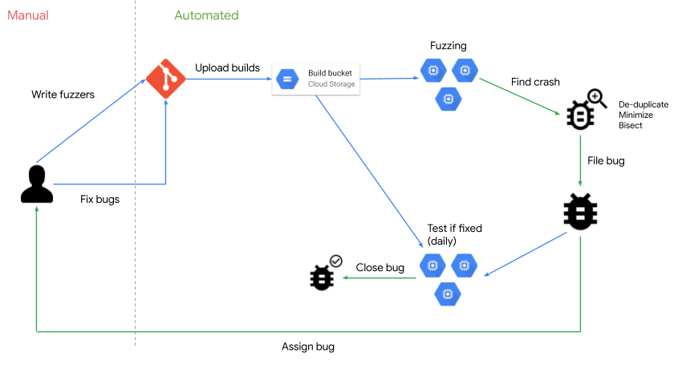

# ClusterFuzz

  

ClusterFuzz is a scalable [fuzzing](https://en.wikipedia.org/wiki/Fuzzing)
infrastructure that finds security and stability issues in software.

Google uses ClusterFuzz to fuzz all Google products and as the fuzzing
backend for [OSS-Fuzz].

ClusterFuzz provides many features which help seamlessly integrate fuzzing into
a software project's development process:
- Highly scalable. Can run on any size cluster (e.g. OSS-Fuzz instance runs on
  100,000 VMs).
- Accurate deduplication of crashes.
- Fully automatic bug filing, triage and closing for various issue trackers
  (e.g. [Monorail], [Jira]).
- Supports multiple [coverage guided fuzzing engines]
  ([libFuzzer], [AFL], [AFL++] and [Honggfuzz])
  for optimal results (with [ensemble fuzzing] and [fuzzing strategies]).
- Support for [blackbox fuzzing].
- Testcase minimization.
- Regression finding through [bisection].
- Statistics for analyzing fuzzer performance, and crash rates.
- Easy to use web interface for management and viewing crashes.
- Support for various authentication providers using [Firebase].

## Overview

  

## Documentation
You can find detailed documentation [here](https://google.github.io/clusterfuzz).

## Trophies
As of February 2023, ClusterFuzz has found ~27,000 bugs in Google (e.g. [Chrome]). Additionally, ClusterFuzz has helped identify and fix over [8,900] vulnerabilities and [28,000] bugs across [850] projects integrated with [OSS-Fuzz].

## Getting Help
You can [file an issue](https://github.com/google/clusterfuzz/issues/new) to ask
questions, request features, or ask for help.

## Staying Up to Date
We will use [clusterfuzz-announce(#)googlegroups.com](https://groups.google.com/forum/#!forum/clusterfuzz-announce) to make announcements about ClusterFuzz.

## ClusterFuzzLite
For a more lightweight version of ClusterFuzz that runs on CI/CD
systems, check out [ClusterFuzzLite](http://github.com/google/clusterfuzzlite).

[Chrome]: https://bugs.chromium.org/p/chromium/issues/list?can=1&q=label%3AClusterFuzz+-status%3AWontFix%2CDuplicate
[8,900]: https://bugs.chromium.org/p/oss-fuzz/issues/list?q=status%3AFixed%2CVerified%20Type%3DBug-Security&can=1
[28,000]: https://bugs.chromium.org/p/oss-fuzz/issues/list?q=status%3AFixed%2CVerified%20Type%3DBug&can=1
[850]: https://github.com/google/oss-fuzz/tree/master/projects
[OSS-Fuzz]: https://github.com/google/oss-fuzz
[Monorail]: https://opensource.google.com/projects/monorail
[Jira]: https://www.atlassian.com/software/jira
[bisection]: https://en.wikipedia.org/wiki/Bisection_(software_engineering)
[Firebase]: https://firebase.google.com/docs/auth
[libFuzzer]: http://llvm.org/docs/LibFuzzer.html
[AFL]: https://github.com/google/AFL
[AFL++]: https://github.com/AFLplusplus/AFLplusplus
[Honggfuzz]: https://github.com/google/honggfuzz
[blackbox fuzzing]: https://google.github.io/clusterfuzz/setting-up-fuzzing/blackbox-fuzzing/
[coverage guided fuzzing engines]: https://google.github.io/clusterfuzz/setting-up-fuzzing/libfuzzer-and-afl/
[fuzzing strategies]: https://i.blackhat.com/eu-19/Wednesday/eu-19-Arya-ClusterFuzz-Fuzzing-At-Google-Scale.pdf#page=27
[ensemble fuzzing]: https://www.usenix.org/system/files/sec19-chen-yuanliang.pdf
