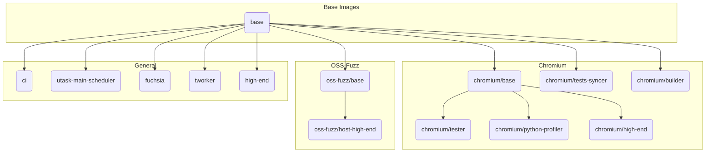

# Docker Images

This directory contains the Dockerfiles for various images used by ClusterFuzz.

## Building Images Locally

The `build.sh` script is the primary way to build images locally. It handles the complexities of build contexts and tagging for all images.

### Prerequisites

Ensure you are in the `docker/` directory before running the script:
```bash
cd docker
```

### Usage

The script builds all images defined in its configuration. You must specify the Ubuntu version to build for.

```bash
# Usage: ./build.sh <ubuntu-version> [git-hash] [--no-push]
```

-   `<ubuntu-version>`: **(Required)** The Ubuntu version to build (e.g., `20.04`, `24.04`). The script will look for a corresponding `.Dockerfile` for each image.
-   `git-hash`: (Optional) A git hash to use for tagging the image. Defaults to the current `HEAD`.
-   `--no-push`: (Optional) A flag to prevent the script from pushing the built images to the container registry. This is useful for local testing.

### Examples

**1. Build all `ubuntu-24.04` images for local testing:**
```bash
./build.sh ubuntu-24-04 --no-push
```

**2. Build and push all `ubuntu-20.04` images:**
```bash
./build.sh ubuntu-20.04
```

## Manual Build (for a single image)

While using `build.sh` is recommended, you can build a specific image manually. You must run the `docker build` command from the **root of the clusterfuzz repository**.

For example, to build the `base` image for `ubuntu-24.04`:

```bash
# Note: This command requires manually handling the build context.
# The build.sh script handles this automatically.
docker build -f docker/base/ubuntu-24-04.Dockerfile docker/base
```

## Production Builds

Production images are built using Google Cloud Build. The configuration is defined in `cloudbuild.yaml`, which uses the `build.sh` script. The build process is automated with the following triggers:

-   **Pull Requests:** A trigger runs on every pull request that modifies files under the `docker/` directory. It builds all images with the `--no-push` flag to validate the changes without deploying them.
-   **Push to `master`:** A trigger runs on every push to the `master` branch that modifies files under the `docker/` directory. It builds and pushes all images to the container registry, making them available for production use.

## Docker Image Dependency Tree

