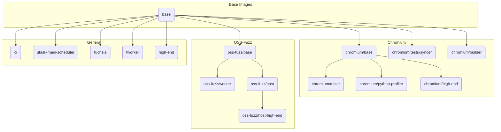

# Docker Build Instructions

## Local testing

You can build a specific image locally using the `docker build` command from the root of the **clusterfuzz** repository.

For example, to build the `base` image, run the following command from the root of the **clusterfuzz** repository:

```bash
docker build -f docker/base/Dockerfile docker/base
```

### Command Explanation

*   `docker build`: The standard command to build a Docker image.
*   `-f docker/base/Dockerfile`: This flag specifies the path to the `Dockerfile` to be used, relative to the repository root.
*   `docker/base`: This is the "build context". The Docker daemon will have access to all files and folders within this path. This is necessary for the `COPY` instructions in the `Dockerfile`.

You can adapt this command to build other images by changing the path to the `Dockerfile` and the build context accordingly.

## Production

To build all images on container builder, run:

```bash
./build_on_container_builder.sh
```

Note that your checkout needs to be on the latest deployed commit.
You also need to have access to the `clusterfuzz-images` project.
## Docker Image Dependency Tree


